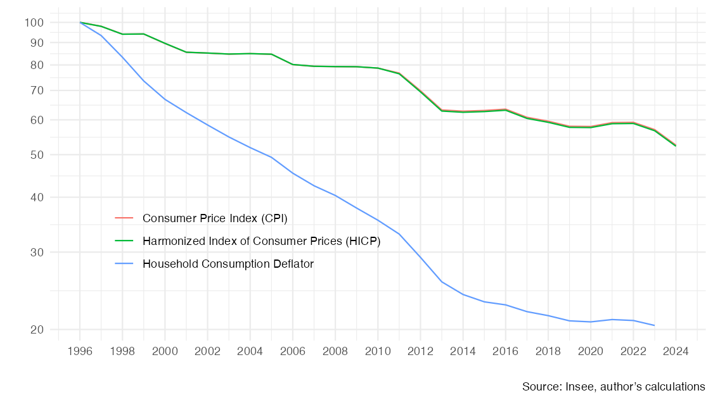
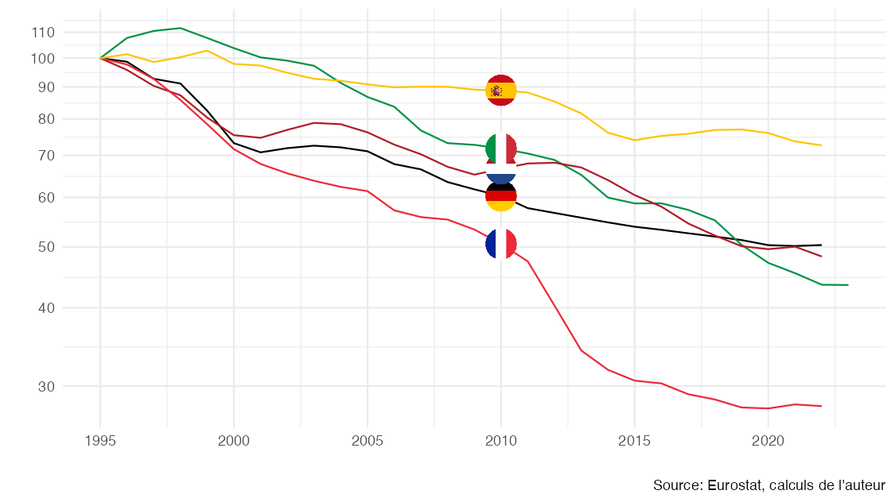
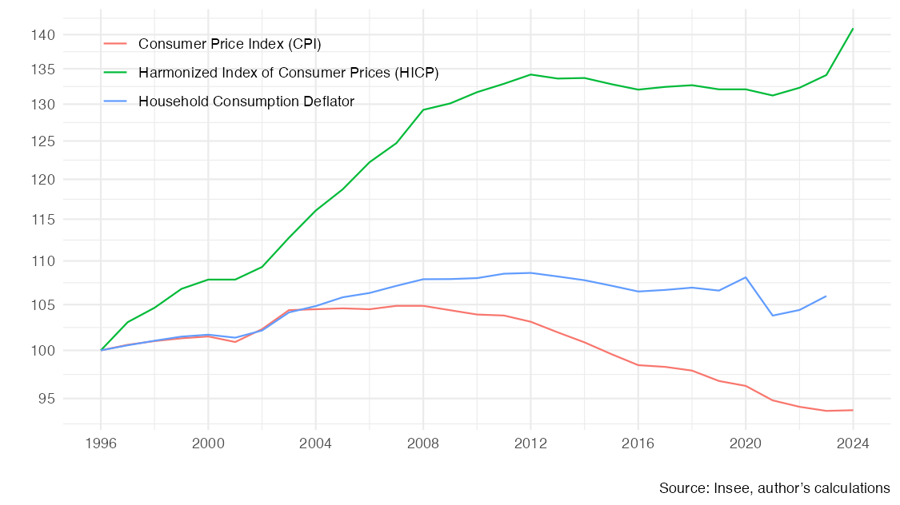
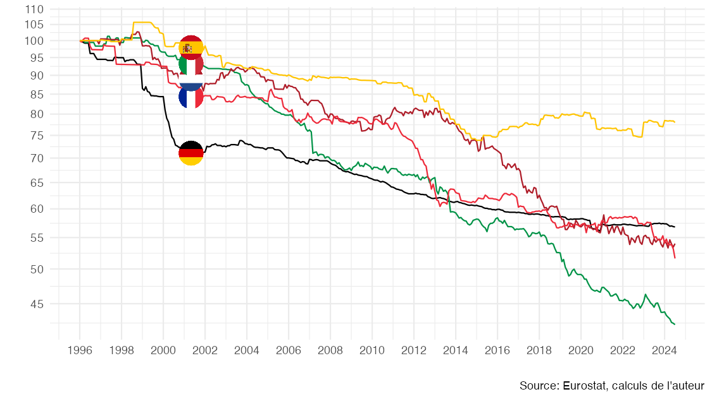
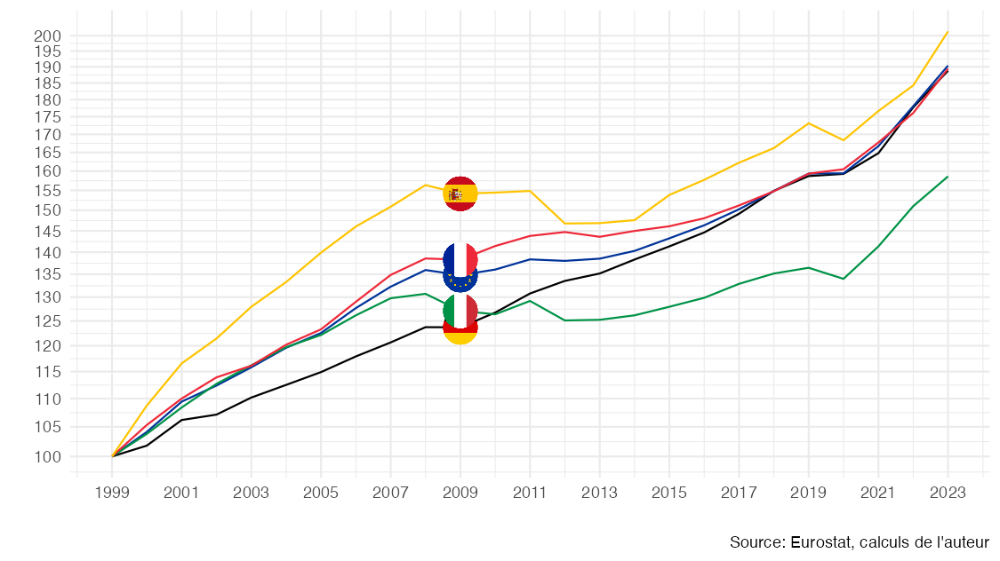
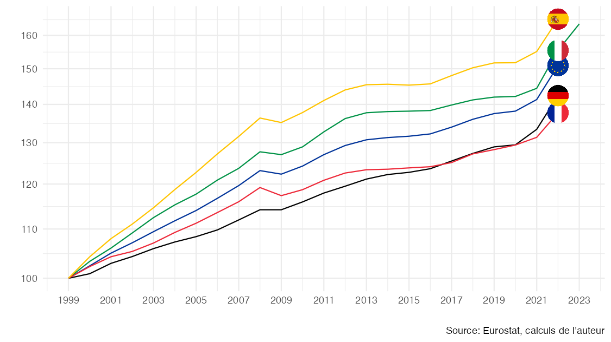
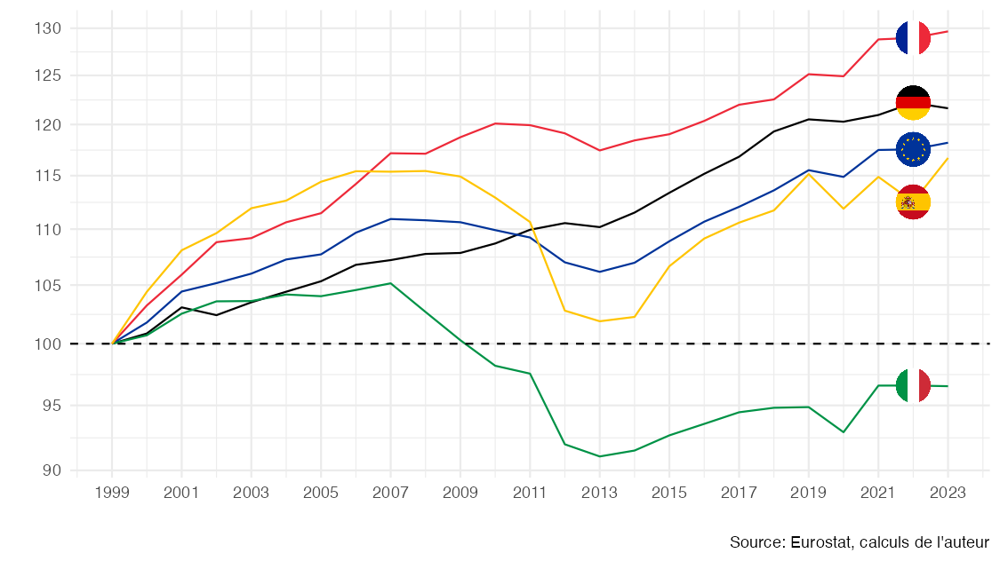

# Measuring “the” Purchasing Power

This repository provides replication codes for the [working paper linked here](https://fgeerolf.com/mesurer-le-pouvoir-d-achat.html).

## Replication

The repository contains everything needed to replicate the figures and data from the [working paper linked here](https://fgeerolf.com/mesurer-le-pouvoir-d-achat.html):

### Figure 1: Household consumption and investment deflators, Base 100 = 1999

[Code R](figure1.R)

### Figure 2: Household consumption deflator vs. HICP and CPI, COICOP 08 - Communications, Base 100 = 1996

[Code R](figure2.R)

### Figure 3: Household consumption deflator for COICOP 08, Base 100 = 1995

[Code R](figure3.R)

### Figure 4: Deflator vs. HICP and CPI for health (COICOP 06), Base 100 = 1996

[Code R](figure4.R)

### Figure 5: HICP for communications (COICOP 08), Base 100 = 1996

[Code R](figure5.R)

### Figure 6: Gross disposable income per capita, nominal (in €), Base 100 = 1999

[Code R](figure6.R)

### Figure 7: Household consumption deflator, Base 100 = 1999

[Code R](figure7.R)

### Figure 9: Gross disposable income per capita deflated by the “household consumption deflator”, Base 100 = 1999

[Code R](figure9.R)

